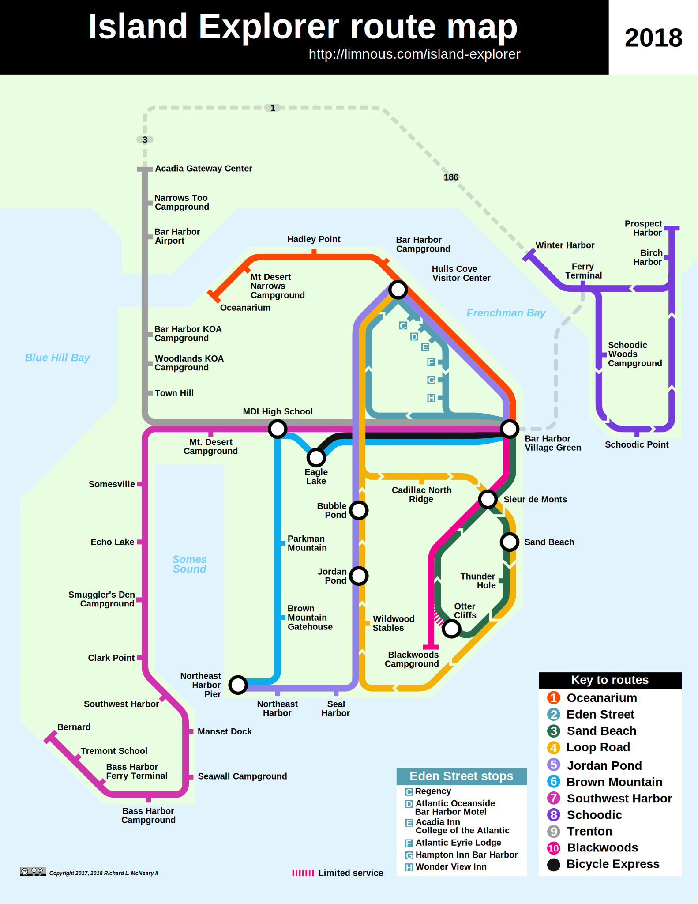
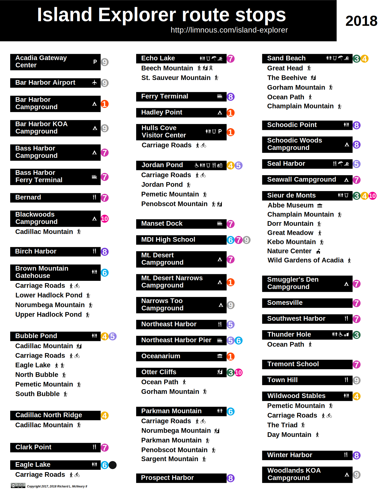

# acadia-map
Map of the Island Explorer routes in Acadia National Park and Mount Desert Island.

A "tube-style" map that displays information about the Island Explorer bus routes in Acadia National Park.

The map and stop image files are licensed under a [Creative Commons Attribution-ShareAlike 4.0 International License](http://creativecommons.org/licenses/by-sa/4.0/).

